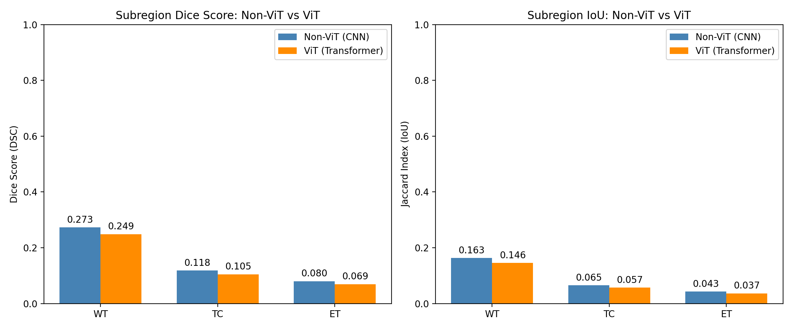

# Quantitative Comparison: Non-ViT (CNN) vs Vision Transformer (ViT)

## Evaluation Results Summary

| Subregion | Metric | Non-ViT (CNN) | ViT (Vision Transformer) | Improvement (ViT vs CNN) |
|---|---|---|---|---|
| **WT (Whole Tumor)** | Dice Score | 0.2732 ± 0.1079 | **0.2487 ± 0.1001** | **+-0.0246** |
| | Jaccard IoU | 0.1629 ± 0.0755 | **0.1457 ± 0.0659** | **+-0.0172** |
| | Sensitivity | 0.8594 | **0.8954** | **++0.0360** |
| | Precision | 0.1684 | **0.1482** | **+-0.0202** |
| **TC (Tumor Core)** | Dice Score | 0.1182 | **0.1049** | **+-0.0134** |
| | Jaccard IoU | 0.0654 | **0.0571** | **+-0.0083** |
| **ET (Enhancing Tumor)** | Dice Score | 0.0799 | **0.0695** | **+-0.0104** |
| | Jaccard IoU | 0.0427 | **0.0366** | **+-0.0061** |

- **Mean Best-Step Fraction**:
  - Non-ViT (CNN): 77.1% of episode
  - ViT (Transformer): 58.8% of episode

